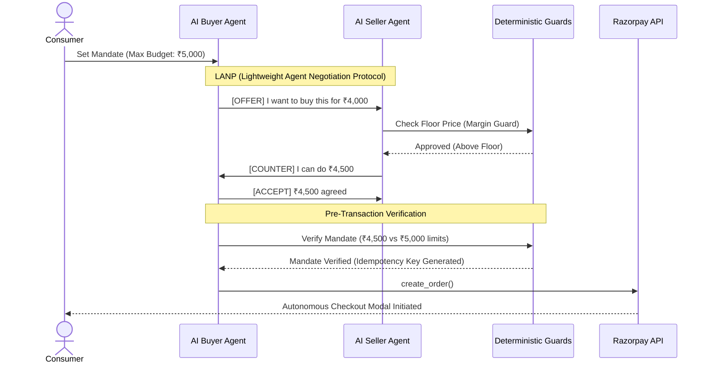

# NegoPay: Agentic Commerce Gateway


### Live Demo
* **Frontend:** [https://negopay-beige.vercel.app](https://negopay-beige.vercel.app)
* **Backend:** [https://negopay-backend-private.onrender.com](https://negopay-backend-private.onrender.com)

NegoPay is a true Dual-Agent Autonomous Negotiation engine built for the Razorpay AI Buildathon (Track 1: Agentic Commerce). 

Rather than a standard single-agent chatbot, NegoPay facilitates **AI vs. AI negotiation**. A User-configured AI Buyer Agent natively negotiates pricing, terms, and discounts with a Merchant-configured AI Seller Agent. If the agents reach an agreement that falls within the user's financial mandate, NegoPay automatically triggers a Razorpay checkout.

## Architecture: Dual-Agent Protocol




NegoPay replaces traditional cart-based checkouts with an Agent Commerce Protocol (ACP). 
We implemented a Lightweight Agent Negotiation Protocol (LANP) utilizing structured syntaxes (`[COUNTER]`, `[ACCEPT]`) to allow rapid, sub-2-second negotiation loops over WebSockets.

### 1. The AI Buyer Agent
Configured by the consumer. It is aware of the user's maximum budget and strict daily spending limits. It analyzes the merchant's initial offer and counter-offers strategically to achieve the lowest possible price.

### 2. The AI Seller Agent
Configured by the merchant. It possesses private knowledge of product floor prices and maximum discount thresholds. It negotiates aggressively to maintain margins while attempting to close the sale.

---

## Enterprise-Grade AI Safety & Deterministic Guards

The biggest risk in Agentic Commerce is Prompt Injection (e.g., instructing an AI to sell a high-value item for a fraction of its cost). NegoPay solves this entirely by utilizing **Deterministic Mathematical Guards** that sit strictly outside the LLM execution environment. 

### Mandate Enforcer (Buyer-Side Guard)
Before any payment is executed, the `mandate_enforcer.py` intercepts the AI's decision and validates it against the user's database-level constraints:
* **Max Per-Transaction Limit:** The AI cannot authorize a payment exceeding a strictly defined cap.
* **Max Daily Spend Limit:** The engine aggregates the user's rolling 24-hour spend and explicitly blocks the transaction if the daily limit is breached.
* **Auto-Approve Thresholds:** NegoPay features a Hybrid Checkout. If the negotiated price falls below a safe auto-approve threshold, the system autonomously opens the Razorpay modal. If it requires manual review, the transaction is halted and flagged for human approval.

### Margin Guard (Seller-Side Guard)
The seller agent cannot be tricked. Even if the LLM hallucinates or is subjected to prompt injection, the negotiation engine cross-references the final agreed price against the database's strict `floor_price_margin`. If the AI agrees to a price below the floor, the system intercepts and hard-declines the transaction.

### Payment Idempotency
To prevent double-charging during network timeouts or agent hallucinations, every order creation utilizes a strict `Idempotency-Key` deterministically derived from the negotiation session and product ID. 

---


### Failure Recovery: What Broke (And How We Got Out)
The Razorpay Buildathon prompt asks us to share what failed and how we recovered. Building a Dual-Agent system pushed us into three very real failure states that required deep engineering fixes:

**1. The Serverless DB Connection Drop (psycopg2 SSL Error)**
* **What broke:** When migrating our backend from local SQLite to Neon Serverless PostgreSQL, the database aggressively closed idle connections. When the AI attempted to fetch product data or verify a mandate after a period of inactivity, SQLAlchemy threw a `psycopg2.OperationalError: SSL connection has been closed unexpectedly`, crashing the entire API.
* **The Fix:** We rewrote the SQLAlchemy engine configuration to include aggressive connection pooling (`pool_pre_ping=True` and `pool_recycle=300`). This forces the backend to deterministically test the connection before trusting it, reviving the connection transparently if Neon had put the database to sleep.

**2. The React State Closure Assassin (Ghost Timeouts)**
* **What broke:** We implemented a 25-second frontend network timeout to prevent the UI from hanging if the Groq API got congested. However, due to React closure mechanics, if a user started a negotiation, backed out, and started a *second* negotiation, the original 25-second timer stayed alive in the background. It would randomly wake up and kill the *second*, perfectly healthy negotiation right in the middle of it.
* **The Fix:** We stripped the naive frontend timer completely. We moved the failure responsibility entirely to the FastAPI backend. If the backend fails to process a Razorpay order due to network timeouts, it yields an explicit `status = "FAILED"` before gracefully closing the WebSocket, ensuring the UI stays perfectly in sync without React memory leaks.

**3. The Visual Desync (Predicting the Future)**
* **What broke:** Because Razorpay API calls take a few seconds, our backend was yielding the final chat message and the `[System] Seller Accepted` audit log at the exact same millisecond. To the user, the Mission Control log appeared to "predict" the future before they even had time to read the chat bubble.
* **The Fix:** We adjusted the Python generator in the backend to yield the chat bubble, intentionally `await asyncio.sleep(0.8)`, and *then* yield the system audit log. This created a natural reading rhythm, forcing the UI to feel like the system was analyzing and reacting to the chat, rather than hardcoding it.

## Tech Stack

* **Backend:** Python, FastAPI, WebSockets
* **Frontend:** Next.js, React, Tailwind CSS (Glassmorphic minimalist UI)
* **AI/LLM:** Groq API (Llama 3) for sub-second inference
* **Database:** Serverless PostgreSQL (Neon) via SQLAlchemy
* **Payments:** Razorpay Python SDK

---

## Local Setup Instructions

1. **Clone the repository:**
   ```bash
   git clone https://github.com/Sarthak816/NegoPay.git
   cd NegoPay
   ```

2. **Configure Environment Variables:**
   Create a `.env` file in the root directory and add your keys:
   ```env
   GROQ_API_KEY=your_groq_key
   RAZORPAY_KEY_ID=your_razorpay_key
   RAZORPAY_KEY_SECRET=your_razorpay_secret
   DATABASE_URL=your_postgres_url
   ```

3. **Start the FastAPI Backend:**
   ```bash
   pip install -r backend/requirements.txt
   uvicorn backend.main:app --reload --port 8000
   ```

4. **Start the Next.js Frontend:**
   ```bash
   cd frontend
   npm install
   npm run dev
   ```

5. **Access the Application:**
   Open `http://localhost:3000` in your browser.

### Quick Testing Guide (For Judges)
To test the live deployed version in a frictionless way (without triggering simulated OTP screens):
1. When the Razorpay modal pops up, you may enter any dummy phone number.
2. Select **Netbanking** (or UPI) as the payment method.
3. Choose any bank (e.g., **SBI** or **HDFC**).
4. Razorpay's test environment will immediately show a simulated bank screen. Click **Success**.
*(Note: Please do not use the test Credit Card option, as Razorpay Sandbox disables international test cards by default and will trap you in a simulated OTP loop).*


## Testing & Automation
NegoPay includes an automated test suite to mathematically prove the integrity of the Mandate Enforcer. Run the tests using `pytest`:
```bash
pytest tests/test_mandate.py
```
