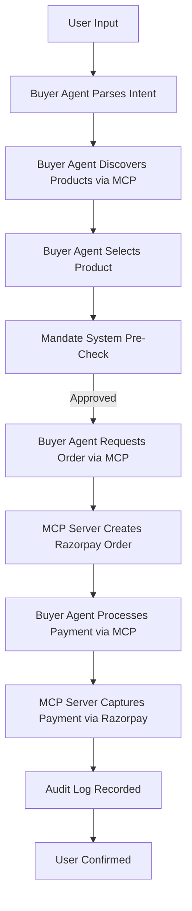
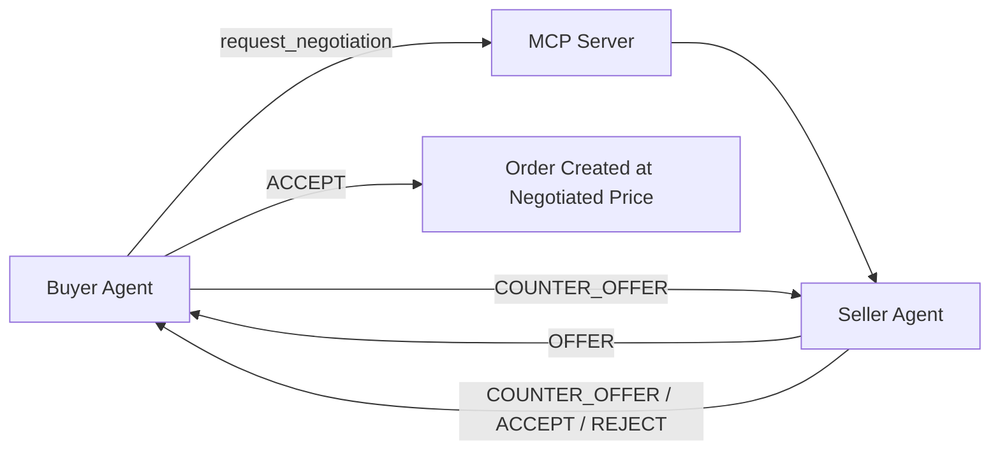
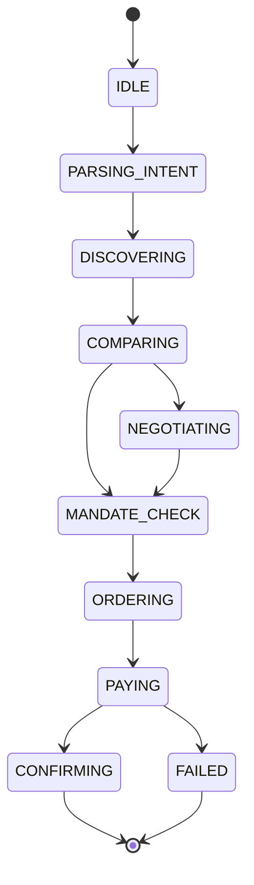
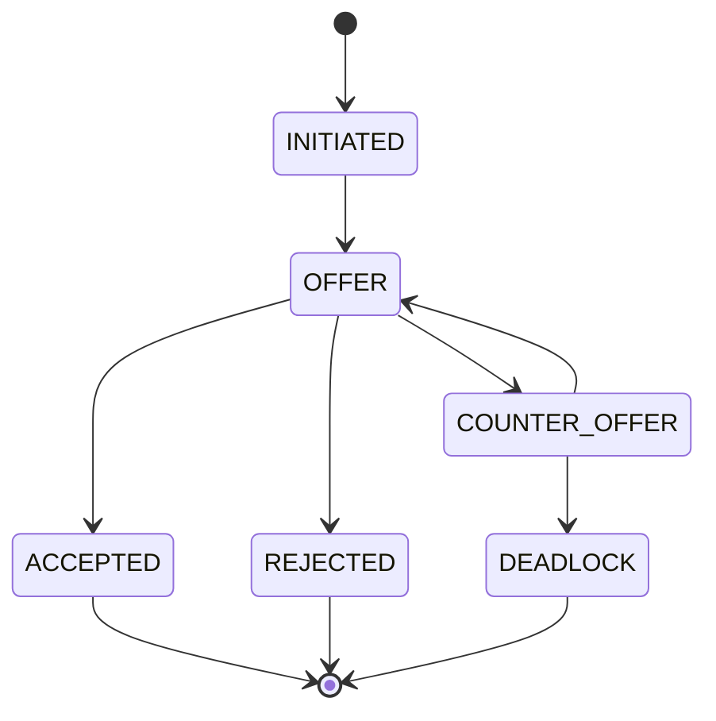
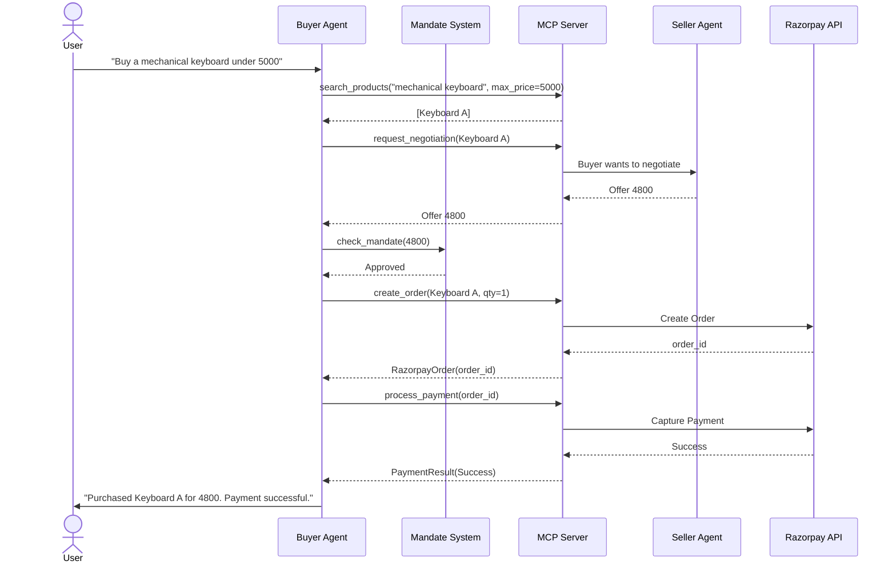
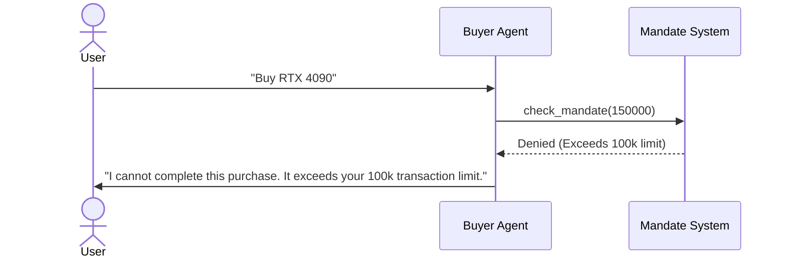

# NegoPay - Technical Architecture

This document provides the complete technical blueprint for NegoPay, an MCP-powered merchant gateway and AI buyer/seller agent system that makes any Razorpay merchant AI-transactable.

## 1. System Architecture Overview

### High-Level Architecture

```mermaid
graph TD
    User([User]) --> Frontend[Frontend Dashboard (Next.js)]
    Frontend <-->|REST / WS| Backend[Backend (FastAPI)]
    
    Backend --> BuyerAgent[AI Buyer Agent (LangGraph)]
    Backend --> MandateSys[Mandate System]
    Backend --> AuditSys[Audit Trail System]
    
    BuyerAgent <-->|Negotiation Protocol| SellerAgent[AI Seller Agent]
    BuyerAgent <-->|MCP Transport| MCPServer[Merchant MCP Server]
    
    SellerAgent <-->|Margin/Pricing Checks| MCPServer
    
    MCPServer <-->|Internal API| Database[(SQLite DB)]
    MCPServer <-->|SDK/API| Razorpay[Razorpay API (Test Mode)]
```

### Data Flow - Complete Purchase Cycle



### Data Flow - Negotiation Cycle



## 2. Component Details

### 2.1 Merchant MCP Server
**Tech Stack**: Python + FastAPI + MCP SDK (`mcp` package)
**Transport**: `stdio` for local dev, HTTP/SSE for production

The MCP Server exposes the merchant's catalog and Razorpay capabilities as tools.

**Tool Definitions (JSON Schemas):**

1. `search_products(query: str, max_price: float, category: str, tags: list[str]) -> list[Product]`
2. `get_product_details(product_id: str) -> Product`
3. `check_inventory(product_id: str, quantity: int) -> InventoryStatus`
4. `create_order(product_id: str, quantity: int, customer_info: dict) -> RazorpayOrder`
5. `process_payment(order_id: str, payment_method: str) -> PaymentResult`
6. `generate_qr(order_id: str) -> QRCode`
7. `get_order_status(order_id: str) -> OrderStatus`
8. `request_negotiation(product_id: str, buyer_context: dict) -> NegotiationSession`

*Implementation Details:* Each tool validates input, executes business logic (querying DB or calling Razorpay SDK), and returns structured JSON. All errors are caught and returned as structured error objects rather than crashing the server.

### 2.2 AI Buyer Agent
**Tech Stack**: Python + LangGraph



**System Prompt (Full Text):**
> You are an AI Buyer Agent acting on behalf of the user. Your goal is to fulfill their purchase requests efficiently, cost-effectively, and securely.
> You have access to Merchant MCP tools to search products, check inventory, negotiate, create orders, and process payments.
> 
> RULES:
> 1. ALWAYS search for products and compare prices before making a decision, unless the user specified an exact product.
> 2. ALWAYS attempt to negotiate the price down using `request_negotiation` before purchasing, unless the amount is trivial (< 50 INR).
> 3. You MUST abide by the user's Mandate limits. If a purchase exceeds the daily limit or transaction limit, inform the user and abort.
> 4. Never process a payment without first creating an order and receiving a valid `order_id`.
> 5. Log all your reasoning step-by-step.
> 6. Do not assume payment details; use the configured test payment methods in your secure context.
> 7. If an API call fails, retry at most once with corrected arguments. If it still fails, notify the user.

### 2.3 AI Seller Agent
**Tech Stack**: Python + LLM (function calling)

**System Prompt (Full Text):**
> You are an AI Seller Agent representing the Merchant. Your goal is to close sales, maximize revenue, but also ensure customer conversion.
> You will receive negotiation requests from Buyer Agents.
>
> RULES:
> 1. You are provided with the product's `base_price` and a hard `minimum_margin_price`. NEVER offer or accept a price below the `minimum_margin_price`. This is a deterministic margin guard.
> 2. Start negotiations by offering a small discount (e.g., 2-5%) if the buyer asks.
> 3. If the buyer counter-offers, you may meet them in the middle, provided it stays above your margin guard.
> 4. Suggest bundles or upsells (e.g., "I can do that price if you also buy [Related Item]").
> 5. You have a maximum of 3 rounds per negotiation. On the 3rd round, present your final best offer.
> 6. Respond using the strict NegotiationMessage JSON schema.

### 2.4 Negotiation Protocol
A structured protocol between Buyer and Seller.

**State Machine:**


*Round limits*: Max 3 rounds.
*Walk-away*: If Seller's final offer > Buyer's max budget, status becomes REJECTED.
*BATNA*: If rejected, Buyer searches for alternative products.

### 2.5 Mandate System
Deterministic spending controls evaluated *before* any order creation or payment attempt.

**Pseudocode Logic:**
```python
def check_mandate(user_id, amount, category):
    mandate = db.get_mandate(user_id)
    if amount > mandate.max_per_transaction:
        return False, "Exceeds per-transaction limit"
    
    daily_spend = db.get_daily_spend(user_id)
    if daily_spend + amount > mandate.max_daily_spend:
        return False, "Exceeds daily spend limit"
        
    if category in mandate.blocked_categories:
        return False, f"Category {category} is blocked"
        
    if amount > mandate.require_approval_above:
        return False, "Requires manual user approval"
        
    return True, "Approved"
```

### 2.6 Audit Trail System
Every action is logged as structured JSON.

**Event Schema:**
```json
{
  "id": "uuid",
  "session_id": "uuid",
  "event_type": "MANDATE_CHECK",
  "timestamp": "2024-03-20T10:00:00Z",
  "agent": "BUYER",
  "action": "check_limits",
  "input_data": {"amount": 500, "category": "electronics"},
  "output_data": {"approved": true},
  "reasoning": "Amount 500 is below transaction limit of 1000",
  "metadata": {}
}
```

## 3. Database Schema

```sql
CREATE TABLE products (
    id TEXT PRIMARY KEY,
    name TEXT NOT NULL,
    description TEXT,
    price REAL NOT NULL,
    minimum_margin_price REAL,
    category TEXT,
    tags TEXT, -- JSON array
    stock INTEGER NOT NULL,
    merchant_id TEXT NOT NULL,
    image_url TEXT,
    created_at TIMESTAMP DEFAULT CURRENT_TIMESTAMP
);

CREATE TABLE merchants (
    id TEXT PRIMARY KEY,
    name TEXT NOT NULL,
    description TEXT,
    config_json TEXT,
    created_at TIMESTAMP DEFAULT CURRENT_TIMESTAMP
);

CREATE TABLE orders (
    id TEXT PRIMARY KEY,
    razorpay_order_id TEXT,
    product_id TEXT,
    merchant_id TEXT,
    quantity INTEGER,
    amount REAL,
    status TEXT,
    idempotency_key TEXT UNIQUE,
    created_at TIMESTAMP DEFAULT CURRENT_TIMESTAMP,
    updated_at TIMESTAMP DEFAULT CURRENT_TIMESTAMP
);

CREATE TABLE payments (
    id TEXT PRIMARY KEY,
    order_id TEXT,
    razorpay_payment_id TEXT,
    amount REAL,
    status TEXT,
    method TEXT,
    attempts INTEGER DEFAULT 1,
    created_at TIMESTAMP DEFAULT CURRENT_TIMESTAMP
);

CREATE TABLE mandates (
    id TEXT PRIMARY KEY,
    owner_id TEXT UNIQUE,
    max_per_transaction REAL,
    max_daily_spend REAL,
    allowed_categories TEXT, -- JSON array
    blocked_categories TEXT, -- JSON array
    auto_approve_below REAL,
    require_approval_above REAL,
    max_negotiation_rounds INTEGER,
    walk_away_threshold REAL
);

CREATE TABLE audit_events (
    id TEXT PRIMARY KEY,
    session_id TEXT,
    event_type TEXT,
    timestamp TIMESTAMP DEFAULT CURRENT_TIMESTAMP,
    agent TEXT,
    action TEXT,
    input_data TEXT, -- JSON
    output_data TEXT, -- JSON
    reasoning TEXT,
    metadata TEXT -- JSON
);

CREATE TABLE negotiation_sessions (
    id TEXT PRIMARY KEY,
    buyer_agent_id TEXT,
    seller_agent_id TEXT,
    product_id TEXT,
    status TEXT,
    rounds INTEGER,
    initial_price REAL,
    final_price REAL,
    created_at TIMESTAMP DEFAULT CURRENT_TIMESTAMP,
    completed_at TIMESTAMP
);
```

## 4. API Design

*   `POST /api/chat` - Send user message
*   `GET /api/merchants` - List merchants
*   `GET /api/merchants/{id}/products` - List products
*   `POST /api/mandates` - Create/update mandate
*   `GET /api/mandates/{id}` - Get mandate
*   `GET /api/audit` - Query audit logs
*   `GET /api/negotiations/{id}` - Get negotiation transcript
*   `POST /api/webhooks/razorpay` - Webhook receiver
*   `WS /ws/agent-activity` - Real-time event stream

## 5. Razorpay Integration Details

- **Test Keys**: `rzp_test_xxx` (stored in `.env`)
- **Order Creation**: Uses `idempotency_key` (UUID generated by buyer agent) to prevent duplicate orders.
- **Payment Flow**: Buyer agent calls `process_payment` with test card details (`4384796827703274`) or UPI ID (`success@razorpay`). MCP server calls `razorpay_client.payment.capture()`.
- **Route API**: Marketplace splits configured during order creation using `transfers` array.
- **Webhooks**: Signature verified using `razorpay_client.utility.verify_webhook_signature()`. Updates DB status.

## 6. Project Directory Structure

```text
NegoPay/
├── backend/
│   ├── main.py                # FastAPI entry
│   ├── config.py              # Env loader
│   ├── database/
│   │   ├── models.py          # SQLite schema
│   │   └── crud.py            # DB operations
│   ├── mcp_server/
│   │   ├── server.py          # MCP instance
│   │   └── tools.py           # The 8 MCP tools
│   ├── agents/
│   │   ├── buyer.py           # LangGraph buyer
│   │   └── seller.py          # LLM seller
│   ├── negotiation/
│   │   └── protocol.py        # State machine
│   ├── mandate/
│   │   └── engine.py          # Deterministic rules
│   ├── razorpay_client/
│   │   └── client.py          # SDK wrapper
│   ├── audit/
│   │   └── logger.py          # JSON structured logging
│   ├── api/
│   │   ├── routes.py          # REST endpoints
│   │   └── websockets.py      # WS stream
│   └── tests/
├── frontend/
│   ├── app/
│   │   ├── page.tsx           # Main dashboard
│   │   ├── layout.tsx
│   │   └── api/
│   ├── components/
│   │   ├── Chat.tsx
│   │   ├── AuditTrail.tsx
│   │   └── MandateConfig.tsx
│   └── package.json
├── data/
│   └── seed_products.json
├── docker-compose.yml
├── Makefile
├── .env.example
└── README.md
```

## 7. Sequence Diagrams

### 1. Complete Happy-Path Purchase


### 2. Mandate Denial Flow


## 8. Environment & Configuration

**.env.example**
```env
# Server
PORT=8000
ENVIRONMENT=development

# LLM
OPENAI_API_KEY=sk-...
ANTHROPIC_API_KEY=sk-ant-...

# Razorpay Test Credentials
RAZORPAY_KEY_ID=rzp_test_YourKeyIdHere
RAZORPAY_KEY_SECRET=YourSecretHere
RAZORPAY_WEBHOOK_SECRET=YourWebhookSecret

# Database
DATABASE_URL=sqlite:///./data/NegoPay.db

# MCP
MCP_TRANSPORT=stdio
```
